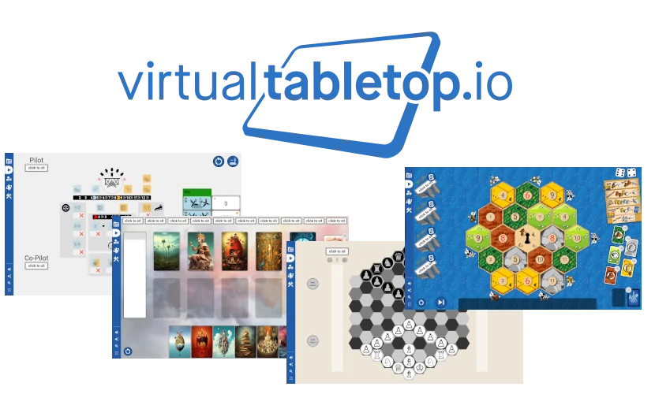
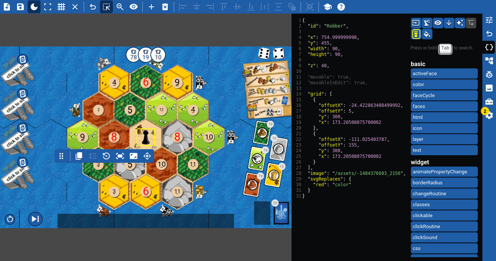

### Play board games in your browser in seconds:

1. ➡️ Go to [virtualtabletop.io](https://virtualtabletop.io).
2. 🎲 Select a game from the library.
3. 🔗 Share the URL with your friends.
4. 🤩 Play!

Free. Open-source. No accounts. No ads. Easy to self-host.

<details>
    <summary><b>🃏 Available games</b></summary>

<br>

> In December 2020 we started with 10 games. In June 2022 we passed 100 games in our public library of included games. In 2025 we are now well over 250 games.

- **Classic board games**: Chess, Checkers, Backgammon, Nine Men's Morris, ...
- **Classic card games**: Poker, Jass, Whist, Doppelkopf, ...
- **Games similar to modern award-winning games like** Catan, Dixit, The Crew, Sky Team, ...
- **"Indie" games**: Godaigo, A Simple Life, Duel 52, Uncheckered, ...
- And everything in between!
</details>

<details>
    <summary><b>🎥 Demo video</b></summary>

https://github.com/user-attachments/assets/10d61e5f-b483-453a-ac5f-ac5f1171d8dd

</details>

> For more details, visit [Playing Games](https://github.com/ArnoldSmith86/virtualtabletop/wiki/Playing-Games) on our wiki.

## 🚀 How does it work?

- The URL is a room (for example `https://virtualtabletop.io/friday-nights`). It looks the same for everyone who visits it.
- Players can click cards to flip them, dice to roll them and drag cards around.
- All interactions are synchronized in real-time to all players.
- Cards snap to holders to make it easier to organize them.
- Many games have a special cards holder that simulates having hands of cards - each player only sees their own cards.

## 🛠️ Forging your own games

The beauty of virtualtabletop.io is that it has a powerful game editor built in.



Creating simple games can be done in a few minutes but there's basically no limit to what you can create:

- Add [widgets](https://github.com/ArnoldSmith86/virtualtabletop/wiki/Widgets) like dice, cards or card holders that work immediately.
- Customize the look and behavior of each widget using the context-sensitive [JSON editor](https://github.com/ArnoldSmith86/virtualtabletop/wiki/Edit-Mode).
- With the full power of CSS at your disposal, you can completely customize the look and feel of your game.
- Optionally automate certain aspects of the game using [routines](https://github.com/ArnoldSmith86/virtualtabletop/wiki/Functions) - a custom programming language inside the JSON.

> For more details, visit [Creating Games](https://github.com/ArnoldSmith86/virtualtabletop/wiki/Creating-Games) on our wiki or look at [our many tutorials](https://virtualtabletop.io/Tutorials#tutorials).

Mastering the game creation process is a bit daunting at first. But there are always people willing to help on our [Discord server](https://discord.gg/CEZz7wny9T).

## 📡 Hosting your own server

> If you just want to play games, you can go to the official server at [virtualtabletop.io](https://virtualtabletop.io).

If you prefer to host your own server, you only need a working [Node.js installation](https://nodejs.org/). The official server uses Node 18 but newer versions should work as well.

Afterwards, you can clone this repository (or download the ZIP file) and install the dependencies by typing:
```
npm install
```

Start the server by typing:
```
npm start
```

This will serve the project at [localhost:8272](http://localhost:8272). The port and some other settings can be configured in the [config.json file](https://github.com/ArnoldSmith86/virtualtabletop/blob/main/config.template.json).

<details>
    <summary><b>🐳 Docker</b></summary>

There's also an official Docker image: https://hub.docker.com/r/arnoldsmith86/virtualtabletop

</details>

<details>
    <summary><b>📱 Android</b></summary>

Using [Termux](https://termux.dev/), you can use an Android phone as the server and play with any devices offline by using its wifi hotspot:

- Install and open https://termux.dev/ on your Android device.
- Run `curl -L is.gd/vttandroid | sh`.

</details>

## 🤝 Contributing

[](https://gitpod.io/#https://github.com/ArnoldSmith86/virtualtabletop)

If you want to contribute to virtualtabletop.io development, please read [Helping Out](https://github.com/ArnoldSmith86/virtualtabletop/wiki/Helping-out).

Finally, we appreciate donations that go towards paying for the domain name, the servers, and additional software supporting game development.  You can donate at https://www.patreon.com/virtualtabletop/about.

Enjoy! And don't be shy about asking questions in [Discord](https://discord.gg/CEZz7wny9T); you will find a helpful and responsive audience.

## 📄 License

The project is licensed under [GPLv3](https://www.gnu.org/licenses/gpl-3.0.en.html).

The cards in [assets/cards-default](https://github.com/ArnoldSmith86/virtualtabletop/tree/main/assets/cards-default) were [created by Adrian Kennard](https://www.me.uk/cards/) and released under CC0 Public Domain license.

The cards in [assets/cards-plastic](https://github.com/ArnoldSmith86/virtualtabletop/tree/main/assets/cards-plastic) have their own [license.txt file](https://github.com/ArnoldSmith86/virtualtabletop/blob/main/assets/cards-plastic/license.txt).

The icons in [assets/icons-white](https://github.com/ArnoldSmith86/virtualtabletop/tree/main/assets/icons-white) were found at [Font Awesome](https://fontawesome.com/) with license [CC BY 4.0](https://fontawesome.com/license/free).

The games in the public library have their license information and attributions inside their `Attribution` section when selecting a game in the Game Shelf.
