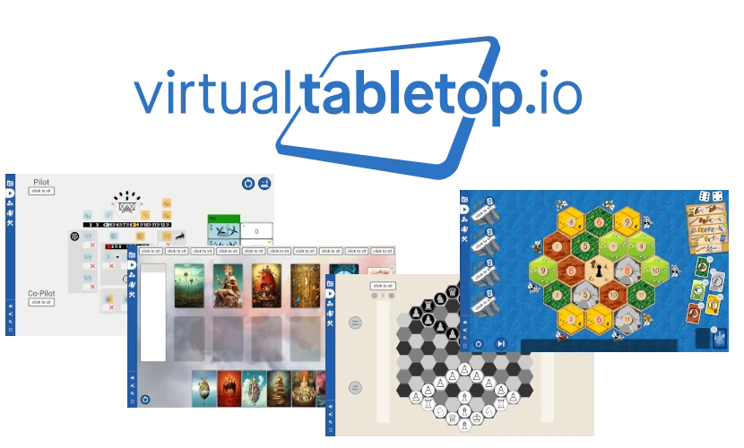
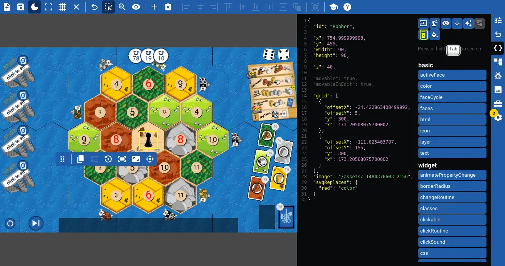

### Play board games in your browser in seconds:

1. ➡️ Go to [virtualtabletop.io](https://virtualtabletop.io).
2. 🎲 Select a game from the library.
3. 🔗 Share the URL with your friends.
4. 🤩 Play!

Free. Open-source. No accounts. No ads. Easy to self-host.

<details>
    <summary><b>🃏 Available games</b></summary>

<br>

> In December 2020 we started with 10 games. In June 2022 we passed 100 games in our public library of included games. By the end of January 2026, we had reached 300 games.

- **Classic board games**: Chess, Checkers, Backgammon, Nine Men's Morris, ...
- **Classic card games**: Poker, Jass, Whist, Doppelkopf, ...
- **Games similar to modern award-winning games like** Catan, Dixit, The Crew, Sky Team, ...
- **"Indie" games**: Godaigo, A Simple Life, Duel 52, Uncheckered, ...
- And everything in between!
</details>

<details>
    <summary><b>🎥 Demo video</b></summary>

https://github.com/user-attachments/assets/10d61e5f-b483-453a-ac5f-ac5f1171d8dd

</details>

> For more details, visit [Playing Games](https://github.com/ArnoldSmith86/virtualtabletop/wiki/Playing-Games) on our wiki.

## 🚀 How does it work?

- The URL is a room (for example `https://virtualtabletop.io/friday-nights`). It looks the same for everyone who visits it.
- Players can click cards to flip them, dice to roll them and drag cards around.
- All interactions are synchronized in real-time to all players.
- Cards snap to holders to make it easier to organize them.
- Many games have a special cards holder that simulates having hands of cards - each player only sees their own cards.
- VirtualTabletop.io does not include built-in voice or video chat. Players typically use external tools such as Discord, Zoom, or Jitsi for voice communication.

## 🛠️ Forging your own games

The beauty of virtualtabletop.io is that it has a powerful game editor built in.



Creating simple games can be done in a few minutes but there's basically no limit to what you can create:

- Add [widgets](https://github.com/ArnoldSmith86/virtualtabletop/wiki/Widgets) like dice, cards or card holders that work immediately.
- Customize the look and behavior of each widget using the context-sensitive [JSON editor](https://github.com/ArnoldSmith86/virtualtabletop/wiki/Edit-Mode).
- With the full power of CSS at your disposal, you can completely customize the look and feel of your game.
- Optionally automate certain aspects of the game using [routines](https://github.com/ArnoldSmith86/virtualtabletop/wiki/Functions) - a custom programming language inside the JSON.

> For more details, visit [📚 Creating Games](https://github.com/ArnoldSmith86/virtualtabletop/wiki/Creating-Games) on our wiki, look at [🎓 our many tutorials](https://virtualtabletop.io/Tutorials#tutorials) or watch a detailed [🎥 YouTube walkthrough](https://www.youtube.com/watch?v=xmdMTWuRO-E).

Mastering the game creation process is a bit daunting at first. But there are always people willing to help on our [💬 Discord server](https://discord.gg/CEZz7wny9T).

## 📡 Hosting your own server

> If you just want to play games, you can go to the official server at [virtualtabletop.io](https://virtualtabletop.io).

If you prefer to host your own server, you only need a working [Node.js installation](https://nodejs.org/). The official server uses Node 18 but newer versions should work as well.

Afterwards, you can clone this repository (or download the ZIP file) and install the dependencies by typing:
```
npm install
```

Start the server by typing:
```
npm start
```

This will serve the project at [localhost:8272](http://localhost:8272). The port and some other settings can be configured in the [config.json file](https://github.com/ArnoldSmith86/virtualtabletop/blob/main/config.template.json).

<details>
    <summary><b>🐳 Docker</b></summary>

There's also an official Docker image: https://hub.docker.com/r/arnoldsmith86/virtualtabletop

</details>

<details>
    <summary><b>🐧 Linux AppImage</b></summary>

If you don't want to install Node.js, you can download an AppImage from the [releases page](https://github.com/ArnoldSmith86/virtualtabletop/releases). It bundles Node.js and a small graphical launcher and is rebuilt monthly. The launcher needs Python 3 with Tk on the host (`python3-tk` on Debian/Ubuntu).

Two variants are available:

- `VirtualTabletop-<hash>-x86_64.AppImage` includes the whole public game library.
- `VirtualTabletop-<hash>-nolibrary-x86_64.AppImage` is much smaller and skips the library - useful if you only play your own games.

Make the file executable (`chmod +x VirtualTabletop-*.AppImage`) and run it.

</details>

<details>
    <summary><b>📱 Android</b></summary>

An Android phone can be the server itself, so everyone plays on their own devices over the phone's WiFi or its hotspot - offline, with no other computer involved.

Download **[VirtualTabletop.apk](https://github.com/ArnoldSmith86/virtualtabletop/raw/main/.android/VirtualTabletop.apk)** and open it on the phone; Android asks once whether the browser or file manager may install it.

- **Install** fetches Node.js, git and VirtualTabletop. This is the only step that needs an internet connection, and it takes about 750 MB.
- **Start server** runs the server on the phone. A notification then shows the address the other devices open, and offers to share it.

[.android/README.md](.android/README.md) says how it works, how to build the APK yourself and what it does instead of [Termux](https://termux.dev/).

</details>

## 🤝 Contributing

[](https://gitpod.io/#https://github.com/ArnoldSmith86/virtualtabletop)

If you want to contribute to virtualtabletop.io development, please read [Helping Out](https://github.com/ArnoldSmith86/virtualtabletop/wiki/Helping-out).

### Browser support

There is no build step: the JavaScript and CSS that are written here are the ones the browser gets, so the features used in the source are the support line. That line is written down as the `browserslist` key in `package.json` — currently **Chrome/Edge 88, Firefox 79, Safari 14.1 (iOS 14.5), Samsung Internet 15**, roughly spring 2021. The Chromium on Android — Chrome for Android and the WebView an app embeds — has no entry of its own because browserslist only ever knows its current release, so no floor can be expressed for it; it is Chromium and ships the Chrome version it is built from, so `chrome >= 88` is what says where that floor is.

`npm run browsercompat` checks the client against it, and the *Browser compatibility* workflow runs the same check on every pull request. It reads the browser support data from [@mdn/browser-compat-data](https://github.com/mdn/browser-compat-data) and reports every at-rule, selector, property, value, global, built-in and syntax construct that is newer than the oldest browser in the key. The two dependencies that reach the browser as they are — dompurify and fflate — are checked too, but only for the syntax they were built to: names say nothing useful once they are minified. The data is a dependency like any other, so a new release of it can report something the release before it did not know about: that is a finding about the client, not a broken check, and it is answered the same way as any other.

Newer features are still fine where they degrade or where something stands in for them. Two of those the check recognises by itself: asking with `@supports` for the very feature that is then used, and declaring a property twice — `overflow: hidden; overflow: clip`, in that order, because the browser keeps the last declaration it understands — or next to its vendor prefixed spelling, which is a property name of its own and may stand on either side. A prefixed spelling only covers the browsers that actually understand it, though: `-webkit-backdrop-filter` next to `backdrop-filter` still leaves Firefox 79 with neither, and the check says so. Anything else says so where it is used:

```css
/* compat-fallback css.at-rules.container: containerQueryFallback.js applies these blocks by hand where they are dropped */
```

`compat-fallback-file` instead of `compat-fallback` covers a whole file, and `tools/browsercompat/exceptions.mjs` lists the features that need no fallback anywhere. All three have to keep excusing something: once the last use of the feature is gone, the check asks for the marker to go too.

Finally, we appreciate donations that go towards paying for the domain name, the servers, and additional software supporting game development.  You can donate at https://www.patreon.com/virtualtabletop/about.

Enjoy! And don't be shy about asking questions in [Discord](https://discord.gg/CEZz7wny9T); you will find a helpful and responsive audience.

## 🧩 Similar platforms

Note that virtualtabletop.io is heavily inspired by playingcards.io. We spent a lot of time building [games](https://www.reddit.com/r/PlayingCardsIO/) and [tools](https://www.reddit.com/r/PlayingCardsIO/comments/inuocb/pcio_editor/) for playingcards.io. It is an amazing platform and definitely easier to get into than virtualtabletop.io but at some point, we craved more features and were afraid of the platform simply disappearing - making our games and tools useless. So in October 2020, a spark by Castux [ignited a fire in one of us (ArnoldSmith86)](https://www.reddit.com/r/PlayingCardsIO/comments/jiajth/comment/ga5zp5b/) to create an open source, self-hostable alternative. While ArnoldSmith86 wrote the first code, many others have made substantial contributions over the years.

But who knows, maybe you'll enjoy a different platform more than ours:

| Platform | Free | Open Source | Browser-Based | Create Own Games | Play without account | Ad-Free | Rule enforcement | Real-time | Asynchronous | AI Opponents | Mobile Support |
|----------|------|-------------|---------------|------------------|------------|---------|-----------------|-----------|--------------|--------------|---------------|
| **[18xx.games](https://18xx.games)** | ✅ | ✅ | ✅ | <details><summary>❌</summary>Only with coding.</details> | <details><summary>❌</summary>No online multiplayer without account.</details> | ✅ | ✅ | ✅ | ✅ | ❌ | ✅ |
| **[Abstract Play](https://abstractplay.com/)** | ✅ | ✅ | ✅ | <details><summary>❌</summary>Only with coding.</details> | ❌ | ✅ | ✅ | ❌ | ✅ | ? | ? |
| **[Board Game Arena](https://boardgamearena.com)** | <details><summary>✅</summary>Many games are free. Many aren't.</details> | ❌ | ✅ | <details><summary>❌</summary>Only with coding and rights to the game.</details> | ❌ | <details><summary>❌</summary>Minor and relevant ads.</details> | ✅ | ✅ | ✅ | <details><summary>❌</summary>Only tutorials and demos.</details> | ✅ |
| **[BoardSpace.net](https://boardspace.net)** | ✅ | ✅ | <details><summary>✅</summary>It's an app but can be used in the browser.</details> | <details><summary>❌</summary>Only with coding.</details> | ✅ | ✅ | ✅ | ✅ | ✅ | ✅ | ✅ |
| **[Board Together](https://boardtogether.games)** | ✅ | ✅ | ✅ | <details><summary>❌</summary>Only with coding.</details> | ❌ | ✅ | ✅ | ✅ | ✅ | ❌ | ✅ |
| **[BrettspielWelt](https://www.brettspielwelt.de)** | ✅ | ❌ | ✅ | ❌ | ❌ | <details><summary>❌</summary>Minor and relevant ads.</details> | ✅ | ✅ | ❌ | ❌ | ✅ |
| **[CardGames.io](https://cardgames.io)** | ✅ | ❌ | ✅ | ❌ | ✅ | ❌ | ✅ | ? | ? | ✅ | ✅ |
| **[FreeBoardGames.org](https://www.freeboardgames.org)** | ✅ | ✅ | ✅ | <details><summary>❌</summary>Only with coding.</details> | ✅ | ✅ | ✅ | ✅ | ❌ | ✅ | ✅ |
| **[Online Board Gamers](https://www.onlineboardgamers.com)** | ✅ | ? | ? | ? | ❌ | ? | ? | ✅ | ? | ❌ | ? |
| **[PlayingCards.io](https://playingcards.io)** | <details><summary>✅</summary>Playing and creating games is free. Some admin features are paid.</details> | ❌ | ✅ | ✅ | ✅ | <details><summary>❌</summary>Unless you pay.</details> | ❌ | ✅ | ✅ | ❌ | ✅ |
| **[Pogo](https://www.pogo.com)** | <details><summary>❌</summary>You can play many games for free but Pogo is pushing monetization pretty hard.</details> | ❌ | ✅ | ? | <details><summary>❌</summary>No online multiplayer without account.</details> | <details><summary>❌</summary>Unless you pay.</details> | ? | ? | ? | ? | ? |
| **[Rally the Troops](https://www.rally-the-troops.com)** | ✅ | ✅ | ✅ | <details><summary>❌</summary>Only with coding.</details> | ❌ | ✅ | ✅ | ✅ | ✅ | ? | ? |
| **[Screentop.gg](https://screentop.gg)** | <details><summary>✅</summary>Playing games is free. Some features for creating games are paid.</details> | ❌ | ✅ | <details><summary>✅</summary>It has a built-in game editor but many features are paid.</details> | ? | ❌ | ❌ | ✅ | ? | ? | ? |
| **[Tabletop Simulator](https://www.tabletopsimulator.com)** | ❌ | ❌ | ❌ | ✅ | ❌ | ✅ | <details><summary>❌</summary>Scripting allows it but many games don't use it.</details> | ✅ | ❌ | ❌ | ❌ |
| **[Tabletopia](https://tabletopia.com)** | <details><summary>❌</summary>You can play a lot for free but it really tries to make you pay.</details> | ❌ | ✅ | <details><summary>✅</summary>Free is limited but you can buy a subscription to do more.</details> | ❌ | ? | ❌ | ✅ | ? | ❌ | <details><summary>✅</summary>Not all games are available.</details> |
| **[Vassal](https://www.vassalengine.org)** | ✅ | ✅ | ❌ | ✅ | ✅ | ✅ | ❌ | ✅ | <details><summary>❌</summary>You can if you mail files back and forth.</details> | ❌ | ❌ |
| **[VirtualTabletop.io](https://virtualtabletop.io)** | ✅ | ✅ | ✅ | ✅ | ✅ | ✅ | <details><summary>❌</summary>Scripting allows it but most games don't use it.</details> | ✅ | ✅ | <details><summary>❌</summary>Scripting allows it in theory but it's way too complicated.</details> | ✅ |
| **[Yucata](https://www.yucata.de)** | ✅ | ❌ | ✅ | ❌ | ❌ | ✅ | ✅ | <details><summary>✅</summary>On newer games. Older games require refreshing the page.</details> | ✅ | ❌ | ❌ |
| **[ZunTzu](https://www.zuntzu.com)** | ? | ? | ❌ | ? | ? | ? | ❌ | ✅ | ? | ❌ | ❌ |

## 📄 License

The project is licensed under [GPLv3](https://www.gnu.org/licenses/gpl-3.0.en.html).

It uses artwork and fonts from various sources. For their licensing information, see the [About section](https://virtualtabletop.io/#About) of the website.

The games in the public library have their license information and attributions inside their `Attribution` section when selecting them in the Game Shelf (or in their [JSON files](https://github.com/ArnoldSmith86/virtualtabletop/tree/main/library/games)).
